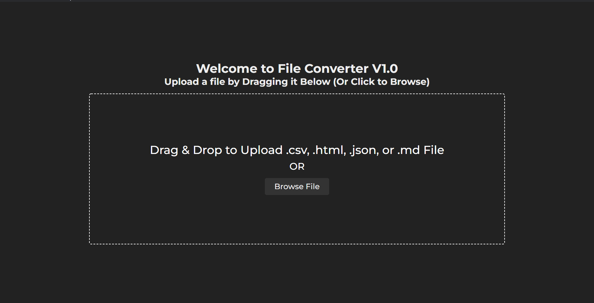
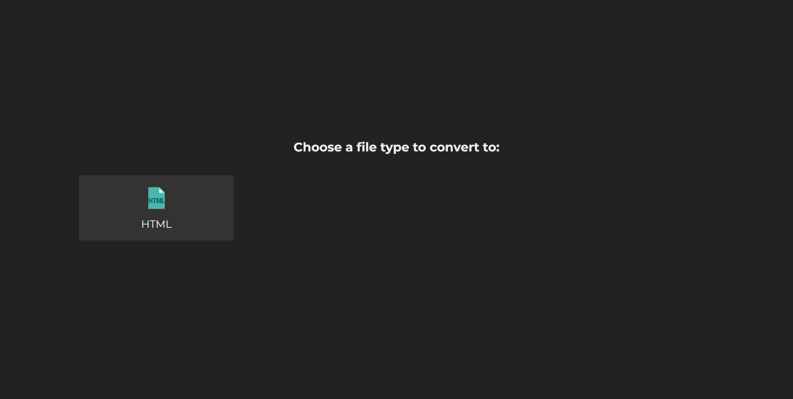
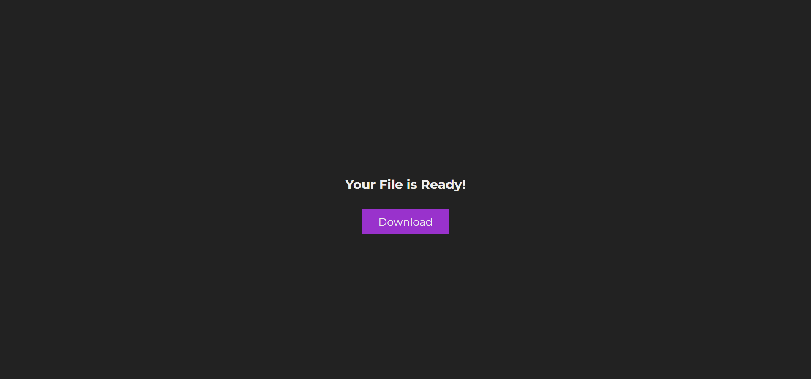

# File converter

A desktop application created using [Electron.js](https://www.electronjs.org/) as a project for the Software Design Patterns course (CPIT-252). MVC design pattern was implemented.

## Installation

- Install the required dependencies using `npm i`
- Run `npm start` to start the application

## Overview

Once the application is started:

Drop a file or click on browse to select a local file

---

Choose the format for the outputted file

---

Download the new file to the desired directory

